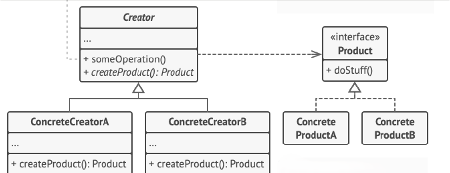

# Contexto de Negócio: Plataforma de E-commerce Personalizada

## Cenário
Você trabalha para uma empresa de tecnologia que desenvolve plataformas de e-commerce personalizadas para diferentes tipos de negócios, como lojas de roupas, eletrônicos, alimentos, etc. Cada tipo de loja tem requisitos específicos para o processo de criação de pedidos, desde o cálculo de descontos até a geração de faturas e o envio de confirmações de pedido.

## Desafio
Você precisa criar uma solução flexível que permita à plataforma de e-commerce instanciar objetos de pedidos específicos de acordo com o tipo de loja sem modificar o código existente toda vez que um novo tipo de loja for adicionado.

## Solução com Factory Method
Implemente o padrão Factory Method para criar objetos de pedido (Order) de diferentes tipos de lojas.

## Padrão a ser adotado

